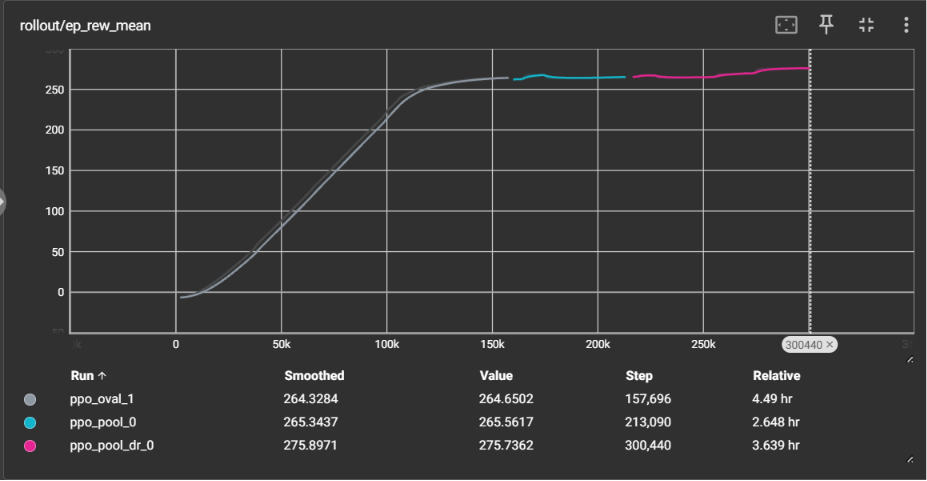

# Line-Follower Robot (RL Policy)

A line-following robot that navigates with a **camera only** — no hardcoded
rules. A small neural network (PPO, trained in simulation on randomly
generated tracks) looks at a 64×64 camera image and picks two wheel speeds.
The plan is sim-to-real: train in Gazebo, deploy on a Jetson Orin Nano, and
drive a real poster-board track that was **never in the training set** —
*"follows a track it has never seen"* is the headline demo. A classical PID
controller (IR sensors + Arduino) is the baseline to beat.

**Status (2026-07-15):** the simulation half is done — trained, evaluated,
and filmed. Hardware phase starts when parts arrive (~Sept 2026).

## Results (simulation)

| | PID baseline | RL policy |
|---|---|---|
| Benchmark oval | 40.4 s/lap | **21.7 s/lap** |
| Tracks never seen in training | not measured yet | **25.7–26.4 s/lap, zero line losses** |
| With randomized camera angle, lighting, noise, motor gains | — | **still zero line losses** (23.6–29.0 s/lap) |

(The PID would likely handle other *clean sim* tracks too — its fixed
threshold and detection band are expected to break under real-world
lighting and camera variation, which is Phase 5's comparison, not this
one. The honest sim-side claim is speed: ~2× at equal reliability.)

All lap times are simulation-time, ground-truth measured; details and
caveats in [`pid_baseline.md`](src/linefollower_sim/docs/pid_baseline.md),
[`generalization_eval.md`](src/linefollower_sim/docs/generalization_eval.md)
and [`dr_eval.md`](src/linefollower_sim/docs/dr_eval.md).

The whole training arc in one picture — oval from scratch (grey), transfer
to 16 random tracks (cyan, no dip), domain randomization (pink, ends
*above* the old ceiling):



## How it works

- **Observation:** the robot camera's 64×64 grayscale frame, nothing else.
  No odometry, no ground truth at inference — those exist only inside the
  training reward.
- **Action:** two wheel speeds in [0, 0.3] m/s, 10 Hz control.
- **Reward:** progress along the track centerline (measured from
  ground-truth pose, so the policy can't cheat its own camera), small
  step cost, episode ends 0.2 m off the line.
- **Random tracks:** a generator builds closed loops that never
  self-intersect (`generate_track.py --seed N`); training uses a pool of
  16 of them in one world, teleporting to a random track every episode.
  Evaluation seeds are structurally excluded from training pools.
- **Domain randomization:** per-episode camera-angle shift (±4.3°),
  brightness/contrast, per-frame sensor noise, and per-wheel speed gains
  (0.9–1.1×, standing in for motor asymmetry and floor friction).

## The honest-engineering section

Things that broke, guesses that were wrong, and one assumption that
died in daylight:

- [The two-bridge echo chamber](src/linefollower_sim/docs/failures/2026-07-13_two_bridge_echo_chamber.md)
  — a zombie process made a freshly trained policy look broken; cost a
  morning, taught the most.
- [kp=1.0 understeers off the first curve](src/linefollower_sim/docs/failures/2026-07-12_pid_kp1_understeer.md)
  — the PID baseline's first two runs, both failures, both on camera.
- [The recurring transport death](src/linefollower_sim/docs/failures/2026-07-15_recurring_transport_death.md)
  — the crash we chose to survive instead of solve.
- **The surprise:** we built random-track training to force generalization
  — then a control experiment showed the oval-only policy *already*
  generalized. A 64×64 view of the next 30 cm has nothing global to
  memorize. Details in
  [`generalization_eval.md`](src/linefollower_sim/docs/generalization_eval.md).

Evidence rules for every claim: uncut recordings, timers/metrics in frame,
failures filmed the day they happen. Stills live in
[`docs/evidence/`](src/linefollower_sim/docs/evidence/); raw TensorBoard
event files are committed under [`training/tb/`](training/tb/).

## Reproduce

Everything runs in WSL2 Ubuntu 22.04 + ROS 2 Humble + Gazebo Fortress
(with `LIBGL_ALWAYS_SOFTWARE=1` — see scripts). From
`src/linefollower_sim/`:

```bash
bash scripts/teleop.sh                    # drive a random track yourself
bash scripts/pid_lap.sh 2.5               # the PID baseline, on camera
bash scripts/rl_train.sh --headless --pool 16 --dr   # train
bash scripts/test_rl_policy.sh --track 1  # eval on a never-seen track
bash scripts/rl_lap.sh --track 1          # watch it drive one (GUI)
```

Every subsystem has a `test_*.sh` done-check.

## Roadmap

- [x] Phase 0 — Setup: WSL2, ROS 2 Humble, Gazebo, this repo
- [x] Phase 1 — Sim world: robot model, camera, random track generator
- [x] Phase 2 — PID baseline in sim: **40.4 s/lap, 0 losses** (the number to beat)
- [x] Phase 3 — RL training: PPO → random tracks → domain randomization; **beaten ~2×, generalization + robustness proven**
- [ ] Phase 4 — Hardware build (Jetson Orin Nano, waiting on parts)
- [ ] Phase 5 — Sim-to-real transfer: the real never-seen track
- [x] Phase 6 — Documentation & failure writeups (ongoing, by design)
